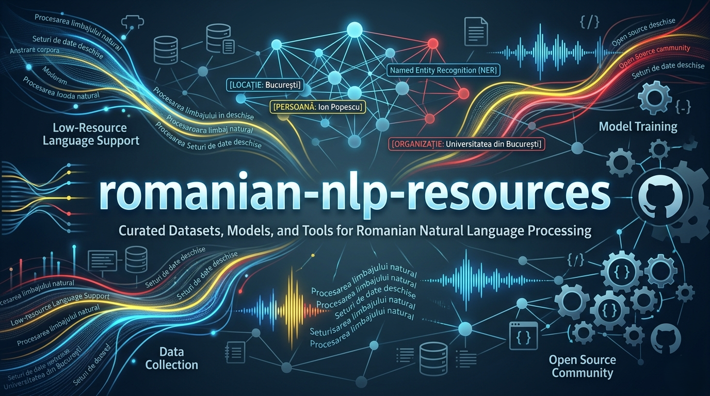

<div align="center">

# RoOpenNLP



### Seturi de date, instrumente si modele NLP deschise pentru limba romana


**Un repository gratuit, reproductibil si extensibil pentru cercetatori, studenti, universitati si companii care lucreaza cu limba romana.**

[Misiune](#misiune) • [Start rapid](#start-rapid) • [Module incluse](#module-incluse) • [Date si licente](#date-si-licente-recomandate) • [Cum poti contribui](#cum-poti-contribui) • [Sustine proiectul](#sustine-proiectul)

</div>

---

## Misiune

Limba romana are nevoie de infrastructura NLP deschisa: corpusuri curate, scheme de adnotare, pipeline-uri de prelucrare, seturi de evaluare, modele de baza si documentatie clara. RoOpenNLP ofera o fundatie serioasa pentru:

- NER: persoane, organizatii, locatii, institutii, produse, evenimente si expresii temporale.
- Speech-to-text: manifeste audio, normalizare transcripturi si evaluare WER/CER.
- Detectarea dezinformarii: scheme de etichetare, esantioane, politici de siguranta si baseline-uri.
- Curatarea corpusurilor: deduplicare, normalizare Unicode, filtrare de calitate si eliminare date personale.
- Reproductibilitate: configuratii, teste, CI, carduri de date, carduri de model si ghiduri de contributie.

> Acest repo nu redistribuie automat corpusuri terte care pot avea restrictii de licenta. Include exemple mici, scheme, scripturi de import si documentatie ca fiecare contributor sa poata adauga date curate, verificabile si legal utilizabile.

---

## Start rapid

```bash
python -m venv .venv
. .venv/Scripts/activate  # Windows PowerShell: .\.venv\Scripts\Activate.ps1
pip install -e ".[dev,ml]"
pytest
```

Comenzi utile:

```bash
ro-open-nlp validate data/samples/disinformation/sample.jsonl --schema disinformation
ro-open-nlp normalize-text data/samples/text_sample.txt --output data/interim/text_normalizat.txt
ro-open-nlp conllu-to-jsonl data/samples/ner/sample.conllu --output data/interim/ner.jsonl
ro-open-nlp speech-manifest data/samples/speech/manifest.csv --output data/interim/speech_manifest.jsonl
```

---

## Structura repository-ului

```text
.
|-- configs/                  # configuratii pentru procesare si antrenare
|-- data/                     # raw/interim/processed + mostre versionabile
|-- docs/                     # ghiduri, metodologie, etica, licente
|-- models/cards/             # model cards pentru baseline-uri
|-- scripts/                  # utilitare CLI reproductibile
|-- src/ro_open_nlp/          # pachet Python
|-- tests/                    # teste unitare
|-- .github/                  # CI si template-uri
|-- CITATION.cff              # citare academica
|-- CONTRIBUTING.md           # cum contribui
|-- GOVERNANCE.md             # guvernanta proiectului
|-- LICENSE                   # licenta cod
`-- LICENSE-DATA.md           # recomandari licente date
```

---

## Module incluse

| Modul | Ce face | Status |
|---|---|---|
| `normalization` | curata Unicode, spatii, ghilimele, diacritice si semne invizibile | functional |
| `dedup` | deduplicare exacta si fuzzy pe texte romanesti | functional |
| `privacy` | detectie si mascarea unor date personale frecvente | functional |
| `ner` | conversie CoNLL-U/IOB in JSONL si validare entitati | functional |
| `speech` | manifest audio standardizat si metrice WER/CER | functional |
| `disinformation` | schema de etichetare si baseline lexical transparent | functional |
| `quality` | scoruri simple pentru calitatea randurilor de corpus | functional |

---

## Date si licente recomandate

RoOpenNLP foloseste o regula simpla: **fara date imposibil de auditat**.

- Date originale din contributii: preferat `CC BY 4.0` sau `CC0`, dupa caz.
- Cod: `MIT`.
- Modele antrenate: recomandat `Apache-2.0` sau `MIT`, daca datele permit.
- Date sensibile: nu se accepta fara anonimizare si fara temei legal clar.
- Date de social media: se pastreaza ID-uri/URL-uri unde licentele si termenii platformei cer acest lucru.

Vezi [docs/licente-si-date.md](docs/licente-si-date.md).

---

## Resurse romanesti publice de pornire

Acest repo include doar scripturi, mostre si documentatie, dar poate lucra cu resurse publice precum:

- RONEC: corpus NER romanesc publicat in format BRAT si CoNLL-U Plus.
- Romanian BERT: model transformer romanesc si instructiuni de reproductibilitate.
- Common Voice: corpus vocal multilingv sub licenta CC0, cu date pentru romana.
- RoCliCo: corpus romanesc pentru clickbait.
- HistNERo: NER pentru ziare istorice romanesti.

Lista extinsa si precautiile de licenta sunt in [docs/resurse-externe.md](docs/resurse-externe.md).

---

## Cum poti contribui

1. Deschide un issue cu tipul contributiei: dataset, script, model, evaluare, documentatie.
2. Completeaza cardul de dataset din [docs/template-dataset-card.md](docs/template-dataset-card.md).
3. Ruleaza validarile locale:

```bash
ruff check .
pytest
ro-open-nlp validate data/samples/disinformation/sample.jsonl --schema disinformation
```

4. Trimite pull request cu exemple mici si instructiuni clare de reproducere.

---

<div align="center">

## Sustine proiectul

**RoOpenNLP este construit pentru cercetatorii din Romania si ramane gratuit.**

Contributiile financiare ajuta la gazduire, curatare de date, adnotare, validare si antrenare de modele.


</div>

<table>
<tr>
<td width="50%">

### Crypto

**Ethereum**

```text
0x27d9a6a5b8507e6031bb044319410da96222d402
```

**Bitcoin**

```text
bc1qf3yy0w8z37rwavxpu38wem3yffpanw7wzj32qj
```

</td>
<td width="50%">

### Wise EUR

**Nume:** Ciprian Stefan Plesca  
**IBAN:** BE83 9679 1975 8915  
**Swift/BIC:** TRWIBEB1XXX  
**Adresa:** Wise, Rue du Trone 100, 3rd floor, Brussels, 1050, Belgium

</td>
</tr>
<tr>
<td>

### Wise GBP

**Nume:** Ciprian Stefan Plesca  
**Numar de cont:** 92055372  
**Sort code:** 23-14-70  
**IBAN:** GB68 TRWI 2314 7092 0553 72  
**Swift/BIC:** TRWIGB2LXXX  
**Adresa:** Wise Payments Limited, 1st Floor, Worship Square, 65 Clifton Street, London, EC2A 4JE, United Kingdom

</td>
<td>

### Wise USD

**Nume:** Ciprian Stefan Plesca  
**Tip cont:** Checking  
**Routing wire/ACH:** 026073150  
**Numar de cont:** 8314225367  
**Swift/BIC:** CMFGUS33  
**Adresa:** Community Federal Savings Bank, 89-16 Jamaica Ave, Woodhaven, NY, 11421, United States

</td>
</tr>
<tr>
<td>

### Wise RON

**Nume:** Ciprian Stefan Plesca  
**IBAN:** RO94 BREL 0005 6026 8420 0100  
**Tip:** Transfer local, intra-bancar din Romania

</td>
<td align="center">

### Multumim

*Fiecare contributie, indiferent de suma, ajuta direct la mentenanta si dezvoltarea RoOpenNLP.*


</td>
</tr>
</table>

---

## Avertisment

Datele si modelele pot produce erori, pot reflecta bias-uri si pot fi nepotrivite pentru decizii cu impact legal, medical, financiar sau social fara validare independenta. Foloseste acest repository responsabil si raporteaza problemele.

## Citare

Daca folosesti RoOpenNLP in cercetare, citeaza fisierul [CITATION.cff](CITATION.cff).
